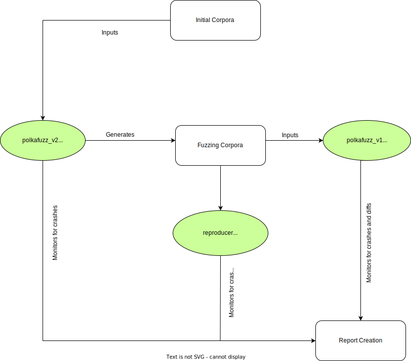
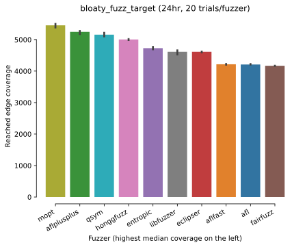

# Polkafuzz Design

## Introduction

Fuzz testing (or fuzzing) is a process that allows the identification of bugs (not just security-related bugs) by providing randomised and unexpected data inputs to software, with the goal of causing crashes (or in Rust, panics) and other unexpected behaviours (e.g. memory leaks).

Popular modern fuzzing frameworks, including AFL, libFuzzer and HonggFuzz, allow for several types of fuzzing:

- **In-process fuzzing**: the fuzzing engine executes the target many times with multiple data inputs in the same process. It must tolerate any kind of input (empty, huge, malformed, etc);
- **White-box fuzzing**: the fuzzing toolset leverages compiler instrumentation and requires access to the source code
- **Coverage-guided fuzzing**: for every input/test case, the fuzzing framework tracks code paths (sections of the code which have been reached), and produces variants of each test case to generate additional input data with the goal of increasing code coverage.

Sigma Prime has been using fuzz testing techniques extensively on a wide variety of security assessments, targeting base layers of different Blockchain projects. This type of testing has been instrumental in helping identify critical vulnerabilities/ In addition to applying these techniques to client engagements, the team has been exercising fuzzers on Lighthouse, the Rust implementation of the Ethereum consensus protocol, developed and maintained by Sigma Prime. This has yielded great results allowing us to pinpoint security vulnerabilities in our own code base and in external dependencies used within Lighthouse.

## Architecture Overview

The following diagram describes the current architecture of polkafuzz:

## Rustlang

Polkafuzz is built using [Rust](https://www.rust-lang.org/), a modern, fast, and memory efficient programming language. It is particularly well suited for processing large amounts of data and CPU-intensive operations, making it a prime candidate for a fuzzing orchestrator.

Considering the fact that Sigma Prime has extensive in-house Rust expertise (see [Lighthouse](https://github.com/sigp/lighthouse), and that the Polkadot ecosystem is predominantly building in Rust, this choice allows us to maximise the ease of maintainability.

## Fuzzing Engines

Polkafuzz supports a variety of different fuzzing engines. Currently, the following engines are integrated:

- **libFuzzer**: An in-process, coverage-guided, evolutionary fuzzing engine. It is linked with the library under test, and feeds fuzzed inputs to the library via a specific fuzzing entrypoint (aka “target function”); the fuzzer then tracks which areas of the code are reached, and generates mutations on the corpus of input data in order to maximize the code coverage. Code coverage information is provided by LLVM’s `SanitizerCoverage` instrumentation.
- **LibAFL**: A highly customisable fuzzing library written in Rust by the [AFL++ team](https://aflplus.plus/), composed of various reusable pieces and supporting different instrumentation backends, namely `SanitizerCoverage`, `Frida`, and `QEMU.`

In the near future, Honggfuzz will also be included as an additional fuzzing engine in Polkafuzz. Honggfuzz is an easy to use evolutionary fuzzer (developed and maintained by Google) with the following interesting features:

- **Multi-process and multi-threaded**: Honggfuzz can leverage all available CPU cores with a single running instance (by automatically sharing the corpus information with all fuzzing processes);
- **Extremely fast with the support of persistent fuzzing**: A standard `LLVMFuzzerTestOneInput` function can be tested with up to 1 million iterations per second
- **Great track record of finding bugs (e.g OpenSSL)**: Honggfuzz is the only fuzzer that managed to identify a critical vulnerability in OpenSSL. The [trophies list](https://github.com/google/honggfuzz#trophies) is quite impressive.
- **Keeps fuzzing even after the identification of a crash**: identification of a crash doesn't mean that the fuzzing stops, as opposed to the behaviour of libFuzzer (painful for continuous fuzzing).

In recent benchmarks published by Google via their project FuzzBench, Honggfuzz seems to be more efficient in terms of reached coverage (code blocks) than AFL and libFuzzer.

## Differential Fuzzing

Differential fuzzing is the process of fuzz testing multiple implementations of the same specification and detecting any deviation/differences between the outputs produced by each of these implementations.

This capability is incorporated into the [`polkafuzz_v2`](./polkafuzz_v2/README.md) tool and leverages Foreign Function Interfaces (FFI) bindings, allowing the support of different implementations made in different programming languages (e.g. Gossamer in Golang).

## Structural Fuzzing

When using a naive fuzzing strategy, raw bytes are passed to the target functions, with the expectation that coverage-guided fuzzing engines will instrument the relevant code and leverage their mutation algorithms to produce samples that will reach a high number of code blocks. Some of the types used in Polkadot can be quite complex, therefore resulting in

By leveraging the latest update to the `libfuzzer-sys` and `cargo_fuzz` crates, we're able to write fuzz targets that take well-formed instances of custom types by deriving and implementing the `Arbitrary` trait, which allows us to create structured inputs from raw byte buffers.

## Triaging

Crashes detected by polkafuzz are reported as [GitHub issues](https://github.com/sigp/polkafuzz/issues) in this repository. For each issue, a ZIP archive is provided which contains artifacts to help reproduce the crash (the [`reproducer`](./reproducer/README.md) tool can be used for this purpose).

This process ensures that all potential bugs and vulnerabilities identified using polkafuzz are thoroughly documented in a central location, allowing various stakeholders to investigate and triage.
